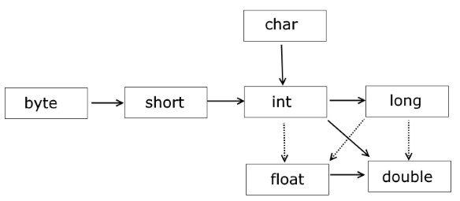

# 3. Основные языковые конструкции Java

## Простая программа на Java

``` java
public class Sample
{
   public static void main(String[] args)
   {
      System.out.println("Hello!");
      System.out.println("Welcome to Java!");
   }
}
```

Проанализируем исходный код класса `Sample`. При определении класса вначале идет модификатор доступа `public`, который указывает, что данный класс будет доступен всем, то есть его можно будет запустить из командной строки. Далее идет ключевое слово `class`, пока будем это считать неким контейнером, в котором реализована программная логика, определяющая порядок работы приложения. Классы являются стандартными блоками, из которых состоят все приложения, написанные на Java. Все, что имеется в программе на Java, должно находиться в пределах класса. Затем идёт название класса `Sample`.

Файл, содержащий исходный текст, должен называться так же, как и открытый (`public`) класс, и иметь расширение файла `.java`. Таким образом, код рассматриваемого здесь класса следует разместить в файле `Sample.java`.

Входной точкой в программу на языке Java является метод `main`, который определен в классе. Именно с него начинается выполнение программы. Он обязательно должен присутствовать в программе. При этом его заголовок может быть только таким:

``` java
public static void main (String args[])
```

_Следует обратить внимание на то, что в языке Java учитывается регистр букв. Так, если вы перепутаете их (например, наберете `Main` вместо `main`), рассматриваемая программа выполняться не будет._

Вначале заголовка метода идет модификатор `public`, который указывает, что метод будет доступен извне (из командной строки и из других классов). Слово `static` указывает, что метод `main` - статический, а слово `void` - что он не возвращает никакого значения. Далее в скобках идут параметры метода - `String args[]` - это массив `args`, который хранит значения типа `String`, то есть строки. При запуске программы через этот массив можно передать в программу различные данные.

Основным строительным блоком методов на языке Java являются инструкции. Каждая инструкция выполняет некоторое действие, например, вызовы других методов, объявление переменных и присвоение им значений. После завершения инструкции в Java ставится точка с запятой (`;`). Данный знак указывает компилятору на конец инструкции.

После заголовка метода идет его блок кода, который содержит набор выполняемых инструкций. Он заключается в фигурные скобки, а инструкции помещаются между открывающей и закрывающей фигурными скобками:

``` java
{
    System.out.println("Hello!");
    System.out.println("Welcome to Java!");
}
```

В рассматриваемом примере кода при выполнении метода `main` в консоль выводятся текстовые строки. Для этой цели используется объект `System.out` и вызывается его метод `println`. Метод всегда отделяется от объекта точкой.

## Комментирование кода

Код программы может содержать комментарии. Комментарии позволяют понять смысл программы, что делают те или иные ее части. При компиляции комментарии игнорируются и не оказывают никакого влияния на работу приложения и на его размер.

В Java есть два основных типа комментариев: однострочный и многострочный. Однострочный комментарий размещается на одной строке после двойного слеша `//`. А многострочный комментарий заключается между символами `/* текст комментария */`. Он может размещаться на нескольких строках. Например:

``` java
/*
    Многострочный комментарий

    Объявление нового класса, который содержит код программы
*/
public class Sample { // начало объявления класса Sample

    // определение метода main
    public static void main(String[] args) { // объявление нового метода
        System.out.println("Hello Java!"); // вывод строки на консоль
    } // конец объявления нового метода
} // конец объявления класса Sample
```

## Типы данных

Язык Java является строго типизированным. Это означает, что тип каждой переменной должен быть явно определен. При этом переменная может принимать только те значения, которые соответствуют ее типу. Если переменная представляет целочисленный тип, то она не может хранить дробные числа.

### Целочисленные типы данных

* `byte`: хранит целое число от `-128` до `127` и занимает 1 байт:

``` java
byte a = 3;
byte b = 8;
```

* `short`: хранит целое число от `-32768` до `32767` и занимает 2 байта:

``` java
short a = 3;
short b = 8;
```

* `int`: хранит целое число от `-2147483648` до `2147483647` (больше 2 млрд) и занимает 4 байта:

``` java
int a = 4;
int b = 9;
```

* `long`: хранит целое число от `–9223372036854775808` до `9223372036854775807` и занимает 8 байт:

``` java
long a = 5L;
long b = 10L;
```

Как правило, наиболее удобным считается тип `int`.

### Числовые типы данных с плавающей точкой

* `float`: хранит число с плавающей точкой от -3.40282347E+38F до 3.40282347E+38F (16-7 значащих десятичных цифр) и занимает 4 байта:

``` java
float x = 8.5F;
float y = 2.7F;
```

* `double`: хранит число с плавающей точкой от -1.7976931348623157E+308F до 1.7976931348623157E+308F (15 значащих десятичных цифр) и занимает 8 байт

``` java
double x = 8.5;
double y = 2.7;
```

В качестве разделителя целой и дробной части в дробных литералах используется точка.

Для большинства приложений тип `double` считается более удобным.

### Символьный тип данных

* `char`: хранит одиночный символ в кодировке UTF-16 и занимает 2 байта, диапазон хранимых значений от 0 до 65535:

``` java
char a = 'A';
char b = 65; // символ 'A'
```

### Логический тип данных

* `boolean`: хранит значение `true` (истина) или `false` (ложь):

``` java
boolean isActive = false;
boolean isAlive = true;
```

## Переменные и константы

Переменные служат в Java для хранения значений. А константы являются переменными, значения которых не изменяются.

### Переменные

Переменная представляет именованную область памяти, которая хранит значение определенного типа. Каждая переменная имеет тип, имя и значение. Тип определяет, какую информацию может хранить переменная.

Пример объявления переменной:

``` java
int x;
```

В этом выражении объявляется переменная `x` типа `int`. То есть `x` будет хранить некоторое число не больше 4 байт.

Объявив переменную, можно присвоить ей значение:

``` java
int x;  // объявление переменной
x = 10; // присвоение значения
```

Также можно присвоить значение переменной при ее объявлении. Этот процесс называется инициализацией:

``` java
int x = 10;            // объявление и инициализация переменной
System.out.println(x); // 10
```

Если не присвоить переменной значение до ее использования, то можно получить ошибку, например, в следующем случае:

``` java
int x;
System.out.println(x);
```

Отличительной особенностью переменных является то, что мы можем в процессе работы программы изменять их значения:

``` java
int x = 10;
System.out.println(x); // 10
x = 25;
System.out.println(x); // 25
```

### Константы

Кроме переменных, в Java для хранения данных можно использовать константы. В отличие от переменных константам можно присвоить значение только один раз. Константа объявляется также, как и переменная, только вначале идет ключевое слово `final`:

``` java
final double PI = 3.14;
System.out.println(PI); // 3.14
// PI = 3.1415;         // так уже нельзя написать, так как PI - константа
```

Константы позволяют задать такие переменные, которые не должны больше изменяться. Например, если есть переменная для хранения числа pi, то можно объявить ее константой, так как ее значение постоянно.

## Операции

### Арифметические операции

* `+` - операция сложения двух чисел:

``` java
int a = 10;
int b = 7;
int c = a + b; // 17
int d = 4 + b; // 11
```

* `-` - операция вычитания двух чисел:

``` java
int a = 10;
int b = 7;
int c = a - b; // 3
int d = 4 - a; // -6
```

* `*` - операция умножения двух чисел

``` java
int a = 10;
int b = 7;
int c = a * b; // 70
int d = b * 5; // 35
```

* `/` - операция деления двух чисел:

``` java
int a = 20;
int b = 5;
int c = a / b;         // 4
double d = 22.5 / 4.5; // 5.0
```

При делении стоит учитывать, что если в операции участвуют два целых числа, то результат деления будет округляться до целого числа, даже если результат присваивается переменной `float` или `double`:

``` java
double k = 10 / 4; // 2
System.out.println(k);
```

Чтобы результат представлял число с плавающей точкой, один из операндов также должен представлять число с плавающей точкой:

``` java
double k = 10.0 / 4; // 2.5
System.out.println(k);
```

* `%` - получение остатка от деления двух чисел:

``` java
int a = 33;
int b = 5;
int c = a % b;  // 3
int d = 22 % 4; // 2 (22 - 4 * 5 = 2)
```

### Арифметические операции с присвоением

В языке Java предусмотрена сокращенная запись арифметических операций с присовением.

* `+=`
``` java
c += b;    // переменной "c" присваивается результат сложения "c" и "b"
с = с + b; // равнозначная инструкция
```

* `-=`
``` java
c -= b;    // переменной "c" присваивается результат вычитания "b" из "c"
с = с - b; // равнозначная инструкция
```

* `*=`

``` java
c *= b;    // переменной "c" присваивается результат произведения "c" и "b"
с = с * b; // равнозначная инструкция
```

* `/=`

``` java
c /= b;    // переменной "c" присваивается результат деления "c" на "b"
с = с / b; // равнозначная инструкция
```

* `%=`

``` java
c %= b;    // переменной "c" присваивается остаток от деления "c" на "b"
с = с % b; // равнозначная инструкция
```

### Инкрементация и декрементация

Инкрементация - увеличение значения переменной на единицу.

Декрементация - уменьшение значения переменной на единицу.

Существуют два вида операций инкремента и декремента. Оба этих вида операций изменяют значение переменной на единицу. Их отличие проявляется только тогда, когда эти операции присутствуют в присваивании. В префиксной форме сначала изменяется значение переменной, и только лишь потом присваивается, а в постфиксной форме присваивается прежнее значение этой переменной, и лишь после данной операции оно изменяется на единицу.

_Операции `++` и `--` изменяют значение переменной, поэтому их нельзя применять к самим числам. Например, выражение `4++` считается недопустимым._

* `++` (префиксный инкремент)

Предполагает увеличение переменной на единицу, например, `z = ++y` (вначале значение переменной `y` увеличивается на `1`, а затем ее значение присваивается переменной `z`)

``` java
int a = 8;
int b = ++a;           // Равнозначные инструкции: b = a + 1;
System.out.println(a); // 9
System.out.println(b); // 9
```

* `++` (постфиксный инкремент)

Также представляет увеличение переменной на единицу, например, `z = y++` (вначале значение переменной `y` присваивается переменной `z`, а потом значение переменной `y` увеличивается на `1`)

``` java
int a = 8;
int b = a++;           // Равнозначные инструкции: b = a; a = a + 1;
System.out.println(a); // 9
System.out.println(b); // 8
```

* `--` (префиксный декремент)

Уменьшение переменной на единицу, например, `z = --y` (вначале значение переменной `y` уменьшается на `1`, а потом ее значение присваивается переменной `z`)

``` java
int a = 8;
int b = --a;           // Равнозначные инструкции: b = a - 1;
System.out.println(a); // 7
System.out.println(b); // 7
```

* `--` (постфиксный декремент)

`z = y--` (сначала значение переменной `y` присваивается переменной `z`, а затем значение переменной `y` уменьшается на `1`)

``` java
int a = 8;
int b = a--;           // Равнозначные инструкции: b = a; a = a - 1;
System.out.println(a); // 7
System.out.println(b); // 8
```

### Условные выражения

Условные выражения представляют собой некоторое условие и возвращают значение типа `boolean`, то есть значение `true` (если условие истинно), или значение `false` (если условие ложно).

#### Операции сравнения

В операциях сравнения сравниваются два операнда, и возвращается значение типа `boolean` - `true`, если выражение верно, и `false`, если выражение неверно.

* `==` - сравнивает два операнда на равенство и возвращает `true`, если операнды равны, и `false`, если операнды не равны

``` java
int a = 10;
int b = 4;
boolean c = a == b;  // false
boolean d = a == 10; // true
```

* `!=` - сравнивает два операнда и возвращает `true`, если операнды НЕ равны, и `false`, если операнды равны

``` java
int a = 10;
int b = 4;
boolean c = a != b;  // true
boolean d = a != 10; // false
```

* `<` (меньше чем) - возвращает `true`, если первый операнд меньше второго, иначе возвращает `false`

``` java
int a = 10;
int b = 4;
boolean c = a < b; // false
```

* `>` (больше чем) - возвращает `true`, если первый операнд больше второго, иначе возвращает `false`

``` java
int a = 10;
int b = 4;
boolean c = a > b; // true
```

* `>=` (больше или равно) - возвращает `true`, если первый операнд больше второго или равен второму, иначе возвращает `false`

``` java
boolean c = 10 >= 10; // true
boolean b = 10 >= 4;  // true
boolean d = 10 >= 20; // false
```

* `<=` (меньше или равно) - возвращает `true`, если первый операнд меньше второго или равен второму, иначе возвращает `false`

``` java
boolean c = 10 <= 10; // true
boolean b = 10 <= 4;  // false
boolean d = 10 <= 20; // true
```

#### Логические операции

Также в Java есть логические операции, которые также представляют условие и возвращают `true` или false и обычно объединяют несколько операций сравнения. К логическим операциям относят следующие:

* `|` (или)

`c = a | b;` (`c` равно `true`, если либо `a`, либо `b` (либо и `a`, и `b`) равны `true`, иначе `c` будет равно `false`)

* `&` (и)

`c = a & b;` (`c` равно `true`, если и `a`, и `b` равны `true`, иначе `c` будет равно `false`)

* `!` (отрицание)

`c = !b;` (`c` равно `true`, если `b` равно `false`, иначе `c` будет равно `false`)

* `^` (исключающее илл)

`c = a ^ b;` (`c` равно `true`, если либо `a`, либо `b` (но не одновременно) равны `true`, иначе `c` будет равно `false`)

* `||` (или)

`c = a || b;` (`c` равно `true`, если либо `a`, либо `b` (либо и `a`, и `b`) равны `true`, иначе `c` будет равно `false`)

* `&&` (и)

`c = a && b;` (`c` равно `true`, если и `a`, и `b` равны `true`, иначе `c` будет равно `false`)

Здесь две пары операций `|` и `||` (а также `&` и `&&`) выполняют похожие действия, однако же они не равнозначны.

Выражение `c = a | b;` будет вычислять сначала оба значения - `a` и `b` и на их основе выводить результат.

В выражении же `c = a || b;` вначале будет вычисляться значение `a`, и если оно равно `true`, то вычисление значения `b` уже смысла не имеет, так как у нас в любом случае уже `c` будет равно `true`. Значение `b` будет вычисляться только в том случае, если `a` равно `false`.

То же самое касается пары операций `&`/`&&`. В выражении `c = a & b;` будут вычисляться оба значения - `a` и `b`.

В выражении же `c = a && b;` сначала будет вычисляться значение `a`, и если оно равно `false`, то вычисление значения `b` уже не имеет смысла, так как значение `c` в любом случае равно `false`. Значение `b` будет вычисляться только в том случае, если `a` равно `true`.

Таким образом, операции `||` и `&&` более удобны в вычислениях, позволяя сократить время на вычисление значения выражения.

#### Таблицы истинности

* Отрицание:

| `a`     | `!a`    |
|---------|---------|
| `false` | `true`  |
| `true`  | `false` |

* И:

| `a`     | `b`     | `a & b` |
|---------|---------|---------|
| `false` | `false` | `false` |
| `false` | `true`  | `false` |
| `true`  | `false` | `false` |
| `true`  | `true`  | `true`  |

* Или:

| `a`     | `b`     | `a || b` |
|---------|---------|----------|
| `false` | `false` | `false`  |
| `false` | `true`  | `true`   |
| `true`  | `false` | `true`   |
| `true`  | `true`  | `true`   |

* Исключающее или:

| `a`     | `b`     | `a ^ b` |
|---------|---------|---------|
| `false` | `false` | `false` |
| `false` | `true`  | `true`  |
| `true`  | `false` | `true`  |
| `true`  | `true`  | `false` |

---

#### Дополнительные материалы

- [Таблица истинности - Википедия](https://ru.wikipedia.org/wiki/Таблица_истинности)

### Преобразование числовых типов

Каждый базовый тип данных занимает определенное количество байт памяти. Это накладывает ограничение на операции, в которые вовлечены различные типы данных.

``` java
int a = 4;
byte b = a; // Ошибка
```

В данном коде произойдёт ошибка. Хотя и тип `byte`, и тип `int` представляют целые числа. Более того, значение переменной `a`, которое присваивается переменной типа `byte`, вполне укладывается в диапазон значений для типа `byte` (от `-128` до `127`). Тем не менее происходит ошибка на этапе компиляции. Поскольку в данном случае присваиваются некоторые данные, которые занимают 4 байта, переменной, которая занимает всего один байт.

Тем не менее в программе может потребоваться, чтобы подобное преобразование было выполнено. В этом случае необходимо использовать операцию преобразования типов (операция `()`):

``` java
int a = 4;
byte b = (byte) a;     // преобразование типов: от типа int к типу byte
System.out.println(b); // 4
```

Операция преобразования типов предполагает указание в скобках того типа, к которому надо преобразовать значение. Например, в случае операции `(byte) a`, идет преобразование данных типа `int` в тип `byte`. В итоге мы получим значение типа `byte`.

#### Автоматическое преобразование



Стрелками на рисунке показано, какие преобразования типов могут выполняться автоматически. Пунктирными стрелками показаны автоматические преобразования с потерей точности.

Пример автоматического преобразования:

``` java
byte b = 7;
int d = b; // преобразование от byte к int
```

В данном случае значение типа `byte`, которое занимает в памяти 1 байт, расширяется до типа `int`, которое занимает 4 байта.

Автоматические преобразования представлены следующими цепочками:

`byte` -> `short` -> `int` -> `long`

`int` -> `double`

`short` -> `float` -> `double`

`char` -> `int`

Некоторые преобразования могут производиться автоматически между типами данных одинаковой разрядности или даже от типа данных с большей разрядностью к типа с меньшей разрядностью. Это следующие цепочки преобразований: `int` -> `float`, `long` -> `float` и `long` -> `double`. Они производятся без ошибок, но при преобразовании мы можем столкнуться с потерей информации.

Пример:

``` java
int a = 2147483647;
float b = a;           // от типа int к типу float
System.out.println(b); // 2.14748365E9
```

#### Приведение типов

Во всех остальных преобразованиях примитивных типов явным образом применяется операция привидения типов. Обычно это преобразования от типа с большей разрядностью к типу с меньшей разрядностью:

``` java
long a = 4;
int b = (int) a;
```

При применении привидения типов мы можем столкнуться с потерей данных. Например, в следующем коде у нас не возникнет никаких проблем:

```
int a = 5;
byte b = (byte) a;
System.out.println(b); // 5
```

Число `5` укладывается в диапазон значений типа `byte`, поэтому после привидения переменная `b` будет равна `5`.

Но в следующем примере результатом будет число `2`:

``` java
int a = 258;
byte b = (byte) a;
System.out.println(b); // 2
```

В данном случае число `258` вне диапазона для типа `byte` (от `-128` до `127`), поэтому произойдет усечение значения.

_Почему результатом будет именно число `2`? Число `a`, которое равно `258`, в двоичном системе будет равно `00000000 00000000 00000001 00000010`. Значения типа `byte` занимают в памяти только 8 бит. Поэтому двоичное представление числа `int` усекается до 8 правых разрядов, то есть `00000010`, что в десятичной системе дает число `2`._

При преобразовании значений с плавающей точкой к целочисленным значениям, происходит усечение дробной части:

``` java
double a = 56.9898;
int b = (int) a;
```

Здесь значение числа `b` будет равно `56`, несмотря на то, что число `57` было бы ближе к `56.9898`.

#### Преобразования при операциях

Нередки ситуации, когда приходится применять различные операции, например, сложение и произведение, над значениями разных типов. Здесь также действуют некоторые правила:

* если один из операндов операции относится к типу `double`, то и второй операнд преобразуется к типу `double`
* если предыдущее условие не соблюдено, а один из операндов операции относится к типу `float`, то и второй операнд преобразуется к типу `float`
* если предыдущие условия не соблюдены, один из операндов операции относится к типу `long`, то и второй операнд преобразуется к типу `long`
* иначе все операнды операции преобразуются к типу `int`

Примеры преобразований:

``` java
int a = 3;
double b = 4.6;
double c = a + b;
```

Так как в операции участвует значение типа `double`, то и другое значение приводится к типу `double` и сумма двух значений `a + b` будет представлять тип `double`.

Другой пример:

``` java
byte a = 3;
short b = 4;
byte c = (byte) (a + b);
```

Две переменных типа `byte` и `short` (не `double`, `float` или `long`), поэтому при сложении они преобразуются к типу `int`, и их сумма `a + b` представляет значение типа `int`. Поэтому если затем мы присваиваем эту сумму переменной типа `byte`, то нам опять надо сделать преобразование типов к `byte`.

Если в операциях участвуют данные типа char, то они преобразуются в int:

``` java
int d = 'a' + 5;
System.out.println(d); // 102
```

### Консольный ввод/вывод

Наиболее простой способ взаимодействия с пользователем представляет консоль: мы можем выводить на консоль некоторую информацию или, наоборот, считывать с консоли некоторые данные. Для взаимодействия с консолью в Java применяется класс `System`, а его функциональность собственно обеспечивает консольный ввод и вывод.

#### Вывод на консоль

Для создания потока вывода в класс `System` определен объект `out`. В этом объекте определен метод `println`, который позволяет вывести на консоль некоторое значение с последующим переводом курсора консоли на следующую строку. Например:

``` java
public class Program {
    public static void main(String[] args) {
        System.out.println("Hello world!");
        System.out.println("Bye world...");
    }
}
```

В метод `println` передается любое значение, как правило, строка, которое надо вывести на консоль. И в данном случае мы получим следующий вывод:

``` text
Hello world!
Bye world...
```

При необходимости можно и не переводить курсор на следующую строку. В этом случае можно использовать метод `System.out.print()`, который аналогичен `println` за тем исключением, что не осуществляет перевода на следующую строку.

``` java
public class Program {
    public static void main(String[] args) {
        System.out.print("Hello world!");
        System.out.print("Bye world...");
    }
}
```

Консольный вывод данной программы:

``` text
Hello world!Bye world...
```

Но с помощью метода `System.out.print` также можно осуществить перевод каретки на следующую строку. Для этого надо использовать escape-последовательность `\n`:

``` java
System.out.print("Hello world \n");
```

Нередко необходимо подставлять в строку какие-нибудь данные. Например, у нас есть два числа, и мы хотим вывести их значения на экран. В этом случае мы можем, например, написать так:

``` java
public class Program {
    public static void main(String[] args) {
        int x=5;
        int y=6;
        System.out.println("x=" + x + "; y=" + y);
    }
}
```

Консольный вывод программы:

``` text
x=5; y=6
```

Но в Java есть также функция для форматированного вывода: `System.out.printf()`. С ее помощью можно переписать предыдущий пример следующим образом:

``` java
int x=5;
int y=6;
System.out.printf("x=%d; y=%d \n", x, y);
```

В данном случае символы `%d` обозначают спецификатор, вместо которого подставляет один из аргументов. Спецификаторов и соответствующих им аргументов может быть множество. В данном случае у нас только два аргумента, поэтому вместо первого `%d` подставляет значение переменной `x`, а вместо второго - значение переменной `y`. Сама буква `d` означает, что данный спецификатор будет использоваться для вывода целочисленных значений.

Кроме спецификатора `%d` мы можем использовать еще ряд спецификаторов для других типов данных:

- `%x`: для вывода шестнадцатеричных чисел
- `%f`: для вывода чисел с плавающей точкой
- `%e`: для вывода чисел в экспоненциальной форме, например, `1.3e+01`
- `%c`: для вывода одиночного символа
- `%s`: для вывода строковых значений

Например:

``` java
public class Program {
    public static void main(String[] args) {
        String name = "Tom";
        int age = 30;
        float height = 1.7f;
          
        System.out.printf("Name: %s  Age: %d  Height: %.2f \n", name, age, height);
    }
}
```

При выводе чисел с плавающей точкой мы можем указать количество знаков после запятой, для этого используем спецификатор на `%.2f`, где `.2` указывает, что после запятой будет два знака. В итоге мы получим следующий вывод:

``` text
Name: Tom  Age: 30  Height: 1,70
```

#### Ввод с консоли

Для получения ввода с консоли в классе `System` определен объект `in`. Однако непосредственно через объект `System.in` не очень удобно работать, поэтому, как правило, используют класс `Scanner`, который, в свою очередь использует `System.in`. Например, напишем маленькую программу, которая осуществляет ввод чисел:

``` java
import java.util.Scanner;

public class Program {
    public static void main(String[] args) {
        Scanner in = new Scanner(System.in);
        System.out.print("Input a number: ");
        int num = in.nextInt();
          
        System.out.printf("Your number: %d \n", num);
        in.close();
    }
}
```

Так как класс `Scanner` находится в пакете `java.util`, то мы вначале его импортируем с помощью инструкции `import java.util.Scanner`.

Для создания самого объекта `Scanner` в его конструктор передается объект `System.in`. После этого мы можем получать вводимые значения. Например, в данном случае вначале выводим приглашение к вводу и затем получаем вводимое число в переменную `num`.

Чтобы получить введенное число, используется метод `in.nextInt()`, который возвращает введенное с клавиатуры целочисленное значение.

Пример работы программы:

``` text
Input a number: 5
Your number: 5
```

Класс `Scanner` имеет еще ряд методов, которые позволяют получить введенные пользователем значения:

- `next()`: считывает введенную строку до первого пробела
- `nextLine()`: считывает всю введенную строку
- `nextInt()`: считывает введенное число `int`
- `nextDouble()`: считывает введенное число `double`
- `nextBoolean()`: считывает значение `boolean`
- `nextByte()`: считывает введенное число `byte`
- `nextFloat()`: считывает введенное число `float`
- `nextShort()`: считывает введенное число `short`

То есть для ввода значений каждого примитивного типа в классе `Scanner` определен свой метод.

Например, создадим программу для ввода информации о человеке:

``` java
import java.util.Scanner;

public class Program {
    public static void main(String[] args) {
        Scanner in = new Scanner(System.in);
        System.out.print("Input name: ");
        String name = in.nextLine();
        System.out.print("Input age: ");
        int age = in.nextInt();
        System.out.print("Input height: ");
        float height = in.nextFloat();
        System.out.printf("Name: %s  Age: %d  Height: %.2f \n", name, age, height);
        in.close();
    }
}
```

Здесь последовательно вводятся данные типов `String`, `int`, `float` и потом все введенные данные вместе выводятся на консоль. Пример работы программы:

``` text
Input name: Tom
Input age: 34
Input height: 1,7
Name: Tom  Age: 34  Height: 1,70
```

Обратите внимание, что для ввода значения типа `float` (то же самое относится к типу `double`) применяется число "1,7", где разделителем является запятая, а не "1.7", где разделителем является точка. В данном случае все зависит от текущей языковой локализации системы. В данном случае русскоязычная локализация, соответственно вводить необходимо числа, где разделителем является запятая. То же самое касается многих других локализаций, например, немецкой, французской и т.д., где применяется запятая.
